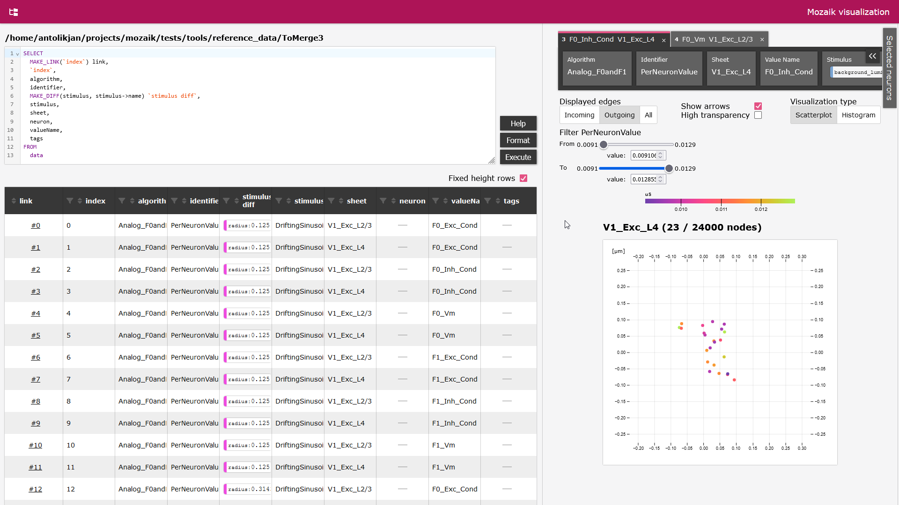

# Visualization tool for mozaik

Example session:


- [documentation](dokumentace.pdf) (in czech)

## How to run visualization

- install requirements.txt
- install mozaik (python3):

```
git clone https://github.com/antolikjan/mozaik.git
cd mozaik
git checkout python3
python setup.py install
```

- run in folder mff_nprg045:
```
bokeh serve --show visualize --args path_to_datastore
```
(path_to_datastore example: /example_data/FeedForwardInhibition_student)

Running bokeh server:
- selecting more disjunct areas in plot is posblie with Shift key

### Bug

There is some bug in Bokeh 2.2.1, so there is KeyError: 'id' error after run the application (related issue: https://github.com/bokeh/bokeh/issues/10453)
